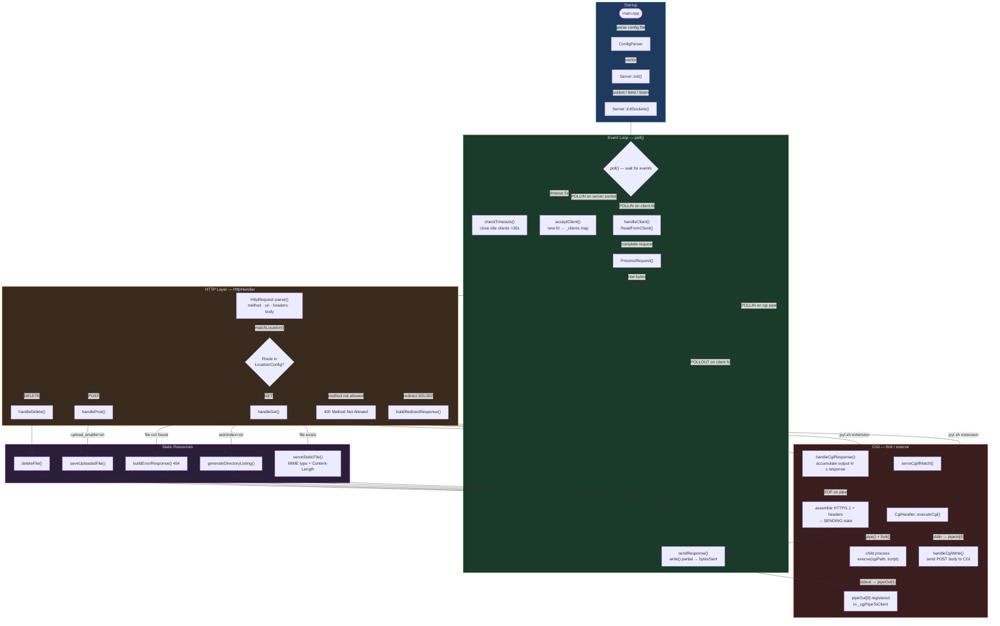

<div align="center">

# Webserv

### A production-grade HTTP/1.1 server built from scratch in C++98

<br>


<br>

</div>

---

## Table of Contents

1. [Project Description](#-project-description)
2. [Architecture Overview](#-architecture-overview)
3. [Key Features](#-key-features)
4. [Technical Modules](#-technical-modules)
5. [Installation & Usage](#-installation--usage)
6. [Configuration Reference](#-configuration-reference)
7. [HTTP Support](#-http-support)
8. [Extended Documentation](#-extended-documentation)
9. [Authors](#-authors)
10. [Resources](#-resources)
11. [AI Usage Disclosure](#-ai-usage-disclosure)

---

## Project Description

**Webserv** is a fully functional HTTP/1.1 web server written entirely in **C++98**, built from the ground up without any external networking libraries or frameworks. Developed as part of the [42 School](https://42.fr) curriculum, this project demands an intimate understanding of every layer of the network stack — from raw TCP sockets to HTTP protocol semantics.

Every time a browser sends a request to `http://localhost:8080/`, this server:
1. Receives the raw bytes over a TCP socket
2. Parses the HTTP request line, headers, and body from scratch
3. Applies routing rules defined in an Nginx-style configuration file
4. Executes external CGI scripts asynchronously if needed
5. Constructs and delivers a fully compliant HTTP/1.1 response

### The C++98 Challenge

The strict **C++98** constraint is not merely cosmetic — it is the core engineering challenge. Without `std::thread`, `std::mutex`, lambda functions, `auto`, range-based for loops, or any modern concurrency primitives, the entire server must handle hundreds of simultaneous connections within **a single thread**. This is achieved through POSIX I/O multiplexing with `poll()` and a rigorous non-blocking, event-driven state machine architecture — the same model used by **Node.js** and historically by **Nginx**.

| Responsibility | Description |
|---|---|
| **Networking** | Create TCP sockets, accept connections, send/receive raw bytes |
| **HTTP Protocol** | Parse requests, generate RFC-compliant responses, manage headers |
| **Configuration** | Read and validate Nginx-style `.conf` files, apply routing rules |
| **CGI Execution** | Fork child processes, route I/O through pipes, handle async responses |
| **Session Management** | Cookie-based in-memory session tracking across requests |

---

## Architecture Overview

The server boots in four sequential phases that never change:

```
./webserv [config_file]
    │
    ├─ 1. ConfigParser::parse()   ← Read & validate the .conf file
    │
    ├─ 2. Server::init()          ← Load ServerConfig objects into memory
    │
    ├─ 3. Server::initSockets()   ← Create TCP sockets, bind(), listen()
    │                                Register fds in poll() watch list
    │
    └─ 4. Server::run()           ← Infinite non-blocking event loop lives here
```

Once inside `run()`, **the server never blocks**. `poll()` monitors all file descriptors simultaneously and dispatches events to the correct handler based on the fd type:

```
poll() returns an event
    │
    ├─ Server fd (POLLIN)     → acceptClient()       ← New TCP connection
    ├─ CGI read pipe (POLLIN) → handleCgiResponse()  ← Script output ready
    ├─ CGI write pipe (POLLOUT)→ handleCgiWrite()    ← Send POST body to script
    └─ Client fd              → handleClient()       ← Read/send data
                                    │
                                    └── switch(ClientState)
                                            ├─ READING_HEADERS
                                            ├─ READING_BODY
                                            ├─ PROCESSING
                                            ├─ CGI_WAITING
                                            ├─ SENDING
                                            └─ DONE
```

### Server Architecture Diagram



### Project File Structure

```
webserv/
├── conf/
│   └── default.conf              # Main server configuration
├── includes/
│   ├── bookstore.hpp             # Central include: all system headers
│   ├── ConfigData.hpp            # Configuration data structures
│   ├── ConfigParser.hpp
│   ├── Server.hpp                # Main server class
│   ├── Client.hpp                # Per-connection state
│   ├── HttpHandler.hpp
│   ├── HttpRequest.hpp
│   ├── CgiHandler.hpp
│   └── SessionManager.hpp
├── src/
│   ├── main.cpp
│   ├── config/
│   │   ├── ConfigParser.cpp
│   │   ├── ConfigParserParse.cpp
│   │   ├── ConfigParserDirectives.cpp
│   │   ├── ConfigParserUtils.cpp
│   │   ├── CgiHandler.cpp
│   │   └── SessionManager.cpp
│   ├── core/
│   │   ├── Server.cpp
│   │   ├── ServerLoop.cpp
│   │   ├── ServerSockets.cpp
│   │   ├── ServerClient.cpp
│   │   └── ServerClientUtils.cpp
│   └── http/
│       ├── HttpHandler.cpp
│       ├── HttpHandlerGet.cpp
│       ├── HttpHandlerPost.cpp
│       ├── HttpHandlerDelete.cpp
│       ├── HttpHandlerError.cpp
│       ├── HttpHandlerSession.cpp
│       ├── HttpHandlerUtils.cpp
│       └── HttpRequest.cpp
├── www/                          # Web content root directory
│   ├── home/                     # Landing page
│   ├── login/                    # Authentication pages
│   ├── dashboard/                # Authenticated area
│   ├── cgi/                      # CGI scripts (Python/Bash)
│   ├── uploads/                  # File upload target directory
│   ├── errors/                   # Custom error pages
│   └── virtual_hosts/            # Virtual host content
└── Makefile
```

---

## Key Features

### Non-Blocking I/O Multiplexing with `poll()`

A single thread manages up to **900 simultaneous client connections** using POSIX `poll()`. Every socket and pipe operates in `O_NONBLOCK` mode — `recv()`, `send()`, and `write()` never stall the event loop. This mirrors the architectural model of production servers like Nginx.

```cpp
// The core event loop — all server logic flows from here
while (!_stop) {
    poll(&_fds[0], _fds.size(), 5000);   // Wait up to 5s for activity
    checkTimeouts();                       // Evict idle clients (>30s)
    for (size_t i = 0; i < _fds.size(); i++) {
        if (_fds[i].revents & POLLIN)  { /* dispatch read events  */ }
        if (_fds[i].revents & POLLOUT) { /* dispatch write events */ }
    }
}
```

### Virtual Hosting

Multiple named virtual servers can share a single port. The correct configuration is selected at runtime by matching the `Host:` header of each HTTP request against the `server_name` directives:

```nginx
server {
    listen 8080;
    server_name blog.example.com;
    # ...
}

server {
    listen 8080;
    server_name api.example.com;
    # ...
}
```

### HTTP Methods: GET, POST, DELETE

| Method | Capabilities |
|---|---|
| **GET** | Static file serving, directory autoindex, CGI execution |
| **POST** | CGI execution, multipart file upload (`multipart/form-data`), `chunked` transfer encoding |
| **DELETE** | File removal with `204 No Content` response |

### Asynchronous CGI Execution (`fork` + `execve` + `pipe`)

CGI scripts (Python, Bash, etc.) run as child processes. The server communicates through two non-blocking pipes and registers them in `poll()` — the event loop never blocks waiting for a script to finish:

```
Server (parent)          Script (child process)
      │                        │
  pipeIn[1] ──── WRITE ──►  stdin   (POST body sent here)
  pipeOut[0] ◄─── READ ───  stdout  (HTTP response read from here)
```

All CGI environment variables are populated per RFC 3875: `REQUEST_METHOD`, `QUERY_STRING`, `CONTENT_LENGTH`, `HTTP_COOKIE`, and all HTTP headers as `HTTP_*` variables.

### Session Management

Built-in cookie-based session system. On each request, the server validates the `session_id` cookie, creates a new session if needed, and injects a `Set-Cookie` header into the response. Sessions are stored in a `std::map` in memory.

### Static File Server

- Serves HTML, CSS, JavaScript, images, and binary files
- Correct `Content-Type` MIME detection by file extension (`.html`, `.css`, `.js`, `.jpg`, `.png`, `.gif`, `.ico`)
- Automatic directory listing (autoindex) when configured
- Configurable default index files

### Robustness Features

- **Payload size enforcement**: Returns `413 Payload Too Large` when `client_max_body_size` is exceeded
- **Connection timeouts**: Clients inactive for >30 seconds are automatically evicted
- **Keep-Alive**: HTTP/1.1 persistent connections supported — the TCP socket is reused for multiple requests
- **Graceful shutdown**: `SIGINT` (Ctrl+C) triggers a clean shutdown that closes all file descriptors
- **`SIGPIPE` suppression**: Writes to closed sockets return `EPIPE` instead of killing the process
- **`SO_REUSEADDR`**: Allows immediate port reuse after server restart without `TIME_WAIT` delays

### Custom Error Pages

A template-based error page system. The server loads `www/errors/default_error.html` and substitutes `{{CODE}}`, `{{TITLE}}`, and `{{MESSAGE}}` tokens at runtime. Falls back to inline-generated HTML if no template is found.

---

## Technical Modules

The codebase is organized into **5 clearly separated modules**:

| Module | Source Files | Responsibility |
|---|---|---|
| **01 — Config Parser** | `ConfigParser*.cpp`, `ConfigData.hpp` | Reads and validates the `.conf` file using a finite-state machine. Produces `ServerConfig` and `LocationConfig` structs consumed by all other modules. |
| **02 — Core & Multiplexing** | `Server.cpp`, `ServerLoop.cpp`, `ServerSockets.cpp` | Creates TCP sockets, runs the `poll()` event loop, dispatches events, manages CGI pipe lifecycle. |
| **03 — Client State Machine** | `ServerClient.cpp`, `ServerClientUtils.cpp`, `Client.hpp` | Tracks each connection through 6 states: `READING_HEADERS → READING_BODY → PROCESSING → CGI_WAITING → SENDING → DONE`. |
| **04 — HTTP Handler** | `HttpHandler*.cpp`, `HttpRequest.cpp` | Parses raw HTTP, routes by URI prefix longest-match, executes GET/POST/DELETE logic, manages redirections. |
| **05 — CGI & Sessions** | `CgiHandler.cpp`, `SessionManager.cpp` | `fork()` + `execve()` + dual-pipe asynchronous CGI execution. In-memory cookie session management. |

### Client State Machine

```
READING_HEADERS → READING_BODY → PROCESSING → SENDING → [DONE or READING_HEADERS]
                                      └──────► CGI_WAITING ──► SENDING
```

Each `Client` object holds its state, accumulated buffer, outgoing response, bytes-sent offset, Keep-Alive flag, and CGI pipe file descriptors. The state machine eliminates the need for threads entirely.

### Routing Algorithm (Longest-Prefix Match)

The router selects the most specific `location` block for any URI — identical to Nginx's behavior:

```
URI: /cgi-bin/app/login.py
Locations: ["/", "/cgi-bin/", "/uploads/"]

→ "/" matches (length 1)
→ "/cgi-bin/" matches (length 9) ← WINNER (most specific)
→ "/uploads/" no match
```

---

## Installation & Usage

### Prerequisites

- `c++` compiler with **C++98** support (`g++` or `clang++`)
- POSIX-compatible OS (Linux or macOS)
- `make`

### Compilation

Clone the repository and compile with the provided `Makefile`:

```bash
git clone <repository-url> webserv
cd webserv
make
```

This produces the `webserv` executable. The build uses strict flags:

```
-Wall -Wextra -Werror -std=c++98
```

**Additional Makefile targets:**

```bash
make clean    # Remove compiled object files (.o)
make fclean   # Remove object files and the webserv binary
make re       # Full clean rebuild (fclean + all)
```

### Running the Server

The server requires a configuration file. If none is provided, it defaults to `conf/default.conf`:

```bash
# Run with default configuration
./webserv

# Run with a specific configuration file
./webserv conf/default.conf

# Run with a custom configuration
./webserv path/to/your/custom.conf
```

Once running, the server listens on the ports defined in the configuration file.

### Testing

```bash
# Test with curl — basic GET request
curl -v http://localhost:8080/

# Test POST with JSON body
curl -X POST http://localhost:8080/cgi-bin/api.py \
     -H "Content-Type: application/json" \
     -d '{"key": "value"}'

# Test file upload
curl -X POST http://localhost:8080/uploads/ \
     -F "file=@/path/to/file.jpg"

# Test DELETE
curl -X DELETE http://localhost:8080/uploads/file.jpg

# Open in browser
open http://localhost:8080/
```

Stop the server at any time with `Ctrl+C` — the server performs a clean shutdown, closing all open file descriptors.

---

## Configuration Reference

The configuration file follows an **Nginx-inspired** syntax with `server` and `location` blocks:

```nginx
server {
    listen       8080;                      # Port to listen on
    server_name  localhost;                 # Virtual host name (Host: header)
    client_max_body_size  1048576;          # Max request body: 1 MB

    error_page  404  /errors/404.html;      # Custom error pages
    error_page  500  /errors/500.html;

    location / {
        root            www;                # Document root
        index           home/index.html;    # Default index file
        allowed_methods GET;                # Restrict HTTP methods
    }

    location /uploads/ {
        root            www/uploads;
        allowed_methods GET POST DELETE;
        upload_enable   true;               # Enable file uploads
        upload_store    www/uploads;        # Upload destination
        autoindex       on;                 # Enable directory listing
    }

    location /cgi-bin/ {
        root            www/cgi;
        allowed_methods GET POST;
        cgi_extension   .py;                # Trigger CGI for .py files
        cgi_path        /usr/bin/python3;   # CGI interpreter path
    }

    location /old-page/ {
        return 301 /new-page/;              # HTTP redirect
    }
}
```

### Supported Directives

| Directive | Scope | Description |
|---|---|---|
| `listen` | server | TCP port to bind |
| `server_name` | server | Virtual host name for `Host:` matching |
| `client_max_body_size` | server | Maximum allowed request body in bytes |
| `error_page` | server | Map HTTP status codes to custom HTML pages |
| `root` | location | Filesystem root for this route |
| `index` | location | Default file for directory requests |
| `autoindex` | location | Enable (`on`) directory listing |
| `allowed_methods` | location | Whitelist of allowed HTTP methods |
| `cgi_extension` | location | File extension that triggers CGI execution |
| `cgi_path` | location | Absolute path to the CGI interpreter |
| `upload_enable` | location | Allow saving uploaded files |
| `upload_store` | location | Directory where uploads are saved |
| `return` | location | HTTP redirect (301/302) |

---

## HTTP Support

### Status Codes Generated

| Code | Text | Trigger |
|---|---|---|
| `200` | OK | Successful static file response |
| `201` | Created | Successful file upload via POST |
| `204` | No Content | Successful DELETE operation |
| `301` | Moved Permanently | `return 301` directive in config |
| `302` | Found | `return 302` directive in config |
| `400` | Bad Request | Malformed HTTP request |
| `403` | Forbidden | Directory without autoindex, upload disabled |
| `404` | Not Found | File does not exist on disk |
| `405` | Method Not Allowed | Method not in `allowed_methods` |
| `413` | Payload Too Large | Body exceeds `client_max_body_size` |
| `500` | Internal Server Error | Error saving uploaded file |
| `501` | Not Implemented | Unrecognized HTTP method |

### Transfer Encoding Support

- **Standard** `Content-Length` bodies
- **Chunked** transfer encoding (`Transfer-Encoding: chunked`) — the server decodes chunked bodies from both clients and CGI scripts

---

## Extended Documentation

> **Our complete knowledge base is available on Notion.**
> It contains detailed technical explanations, architecture diagrams, annotated source code walkthroughs, syscall references, and evaluation FAQs for every module of this project.

<div align="center">

### [Full Technical Documentation & Knowledge Base](https://www.notion.so/Webserv-3336a32e0f34806a9018eeb32598a1eb?source=copy_link)

*Covers: Architecture · I/O Multiplexing · Config Parser · Client State Machine · HTTP Handler · CGI Lifecycle · Session Management*

</div>

---

## Authors

<br>

<div align="center">
<table>
  <tr>
    <td align="center" width="200">
      
      <br><br>
      <strong>alejagom</strong><br>
      <sub>Webserv Team</sub>
      <br><br>
      <a href="https://www.linkedin.com/in/alejandro-gomez-giron-5b840219b/">
        
      </a>
      <a href="https://github.com/alejogogi">
        
      </a>
      <a href="https://profile.intra.42.fr/users/alejagom">
        
      </a>
    </td>
    <td align="center" width="200">
      
      <br><br>
      <strong>sreffers</strong><br>
      <sub>Webserv Team</sub>
      <br><br>
      <a href="https://www.linkedin.com/in/samael-reffers/">
        
      </a>
      <a href="https://github.com/samaelmaza">
        
      </a>
      <a href="https://profile.intra.42.fr/users/sreffers">
        
      </a>
    </td>
    <td align="center" width="200">
      
      <br><br>
      <strong>gafreire</strong><br>
      <sub>Webserv Team</sub>
      <br><br>
      <a href="https://es.linkedin.com/in/gabrielfreiresimon">
        
      </a>
      <a href="https://github.com/ByteGab">
        
      </a>
      <a href="https://profile.intra.42.fr/users/gafreire">
        
      </a>
    </td>
  </tr>
</table>
</div>

---

## Resources

### Official Specifications

| Resource | URL |
|---|---|
| RFC 7230 — HTTP/1.1 Message Syntax | https://tools.ietf.org/html/rfc7230 |
| RFC 7231 — HTTP/1.1 Semantics | https://tools.ietf.org/html/rfc7231 |
| RFC 3875 — CGI/1.1 | https://tools.ietf.org/html/rfc3875 |

### Network Programming

| Resource | URL |
|---|---|
| Beej's Guide to Network Programming | https://beej.us/guide/bgnet/ |
| Beej's Guide to Unix IPC | https://beej.us/guide/bgipc/ |

### Linux Man Pages

| Syscall | URL |
|---|---|
| `poll(2)` | https://man7.org/linux/man-pages/man2/poll.2.html |
| `socket(2)` | https://man7.org/linux/man-pages/man2/socket.2.html |
| `fcntl(2)` | https://man7.org/linux/man-pages/man2/fcntl.2.html |
| `fork(2)` | https://man7.org/linux/man-pages/man2/fork.2.html |
| `execve(2)` | https://man7.org/linux/man-pages/man2/execve.2.html |
| `pipe(2)` | https://man7.org/linux/man-pages/man2/pipe.2.html |

---

## AI Usage Disclosure

In the spirit of full transparency, Artificial Intelligence was used during the development of this project as a conceptual guide and pair-programming assistant for:

- **Critical Bug Fixing & Debugging** — Identifying and resolving complex concurrency issues, `waitpid` handling in asynchronous CGI execution, and server robustness problems during evaluation phases.
- **Frontend Development** — Guiding the design and implementation of the HTML/CSS web interface, login pages, and test sites hosted by the server.
- **Implementation Guidance** — Providing structured explanations for features such as `client_max_body_size` validation, virtual host routing, and HTTP redirect handling.
- **Documentation** — Generating this `README.md` and maintaining compliance checklists aligned with 42 evaluation criteria.

---

<div align="center">

*Built at [42 School](https://42.fr)*

</div>
